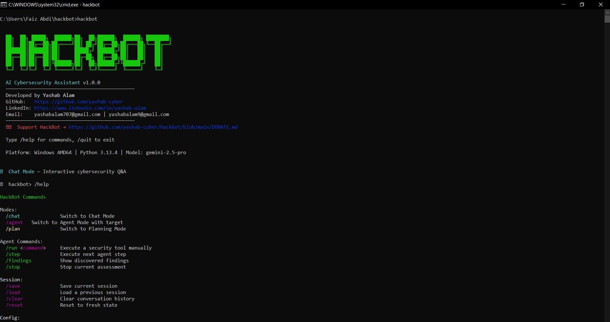
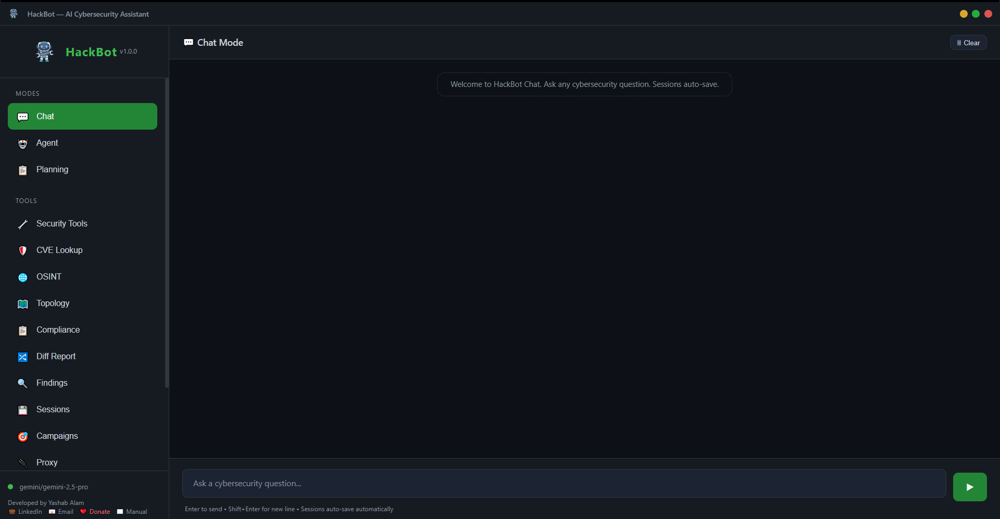
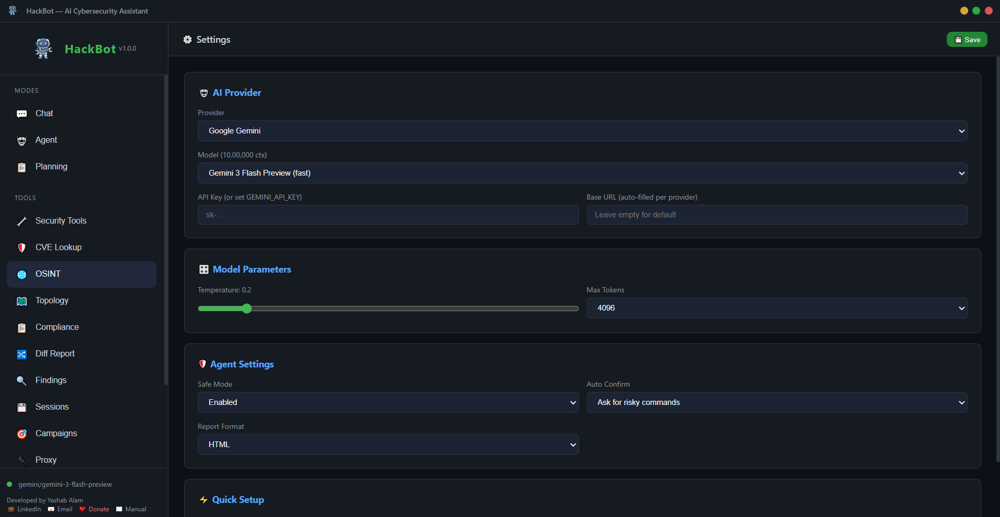

<div align="center">


# HackBot — AI Cybersecurity Assistant

**Production-ready AI-powered pentesting & cybersecurity assistant with Agent, Chat & Planning modes, native desktop GUI, 10 AI providers, and built-in intelligence modules.**

[](https://github.com/yashab-cyber/hackbot/actions)
[](https://www.python.org/downloads/)
[](LICENSE)
[]()
[]()
[](https://colab.research.google.com/github/yashab-cyber/hackbot/blob/main/examples/HackBot_Colab.ipynb)
[](https://discord.gg/X2tgYHXYq)

[Features](#-features) • [Screenshots](#-screenshots) • [GUI](#%EF%B8%8F-native-desktop-gui) • [Install](#-installation) • [Quick Start](#-quick-start) • [Modes](#-modes) • [Intelligence](#%EF%B8%8F-intelligence-modules) • [Providers](#-ai-providers) • [Config](#%EF%B8%8F-configuration) • [Docker](#-docker) • [Colab](#-run-on-google-colab) • [Discord](#-community)

</div>

---

## 👨‍💻 About the Author

<table>
  <tr>
    <td><strong>Developer</strong></td>
    <td><strong>Yashab Alam</strong></td>
  </tr>
  <tr>
    <td>🐙 GitHub</td>
    <td><a href="https://github.com/yashab-cyber">github.com/yashab-cyber</a></td>
  </tr>
  <tr>
    <td>💼 LinkedIn</td>
    <td><a href="https://www.linkedin.com/in/yashab-alam">linkedin.com/in/yashab-alam</a></td>
  </tr>
  <tr>
    <td>📧 Email</td>
    <td><a href="mailto:yashabalam707@gmail.com">yashabalam707@gmail.com</a> · <a href="mailto:yashabalam9@gmail.com">yashabalam9@gmail.com</a></td>
  </tr>
  <tr>
    <td>❤️ Donate</td>
    <td><a href="DONATE.md"><strong>Support HackBot → DONATE.md</strong></a></td>
  </tr>
</table>

> HackBot is free & open-source. If it has helped you, please consider [supporting its development](DONATE.md) or reaching out for collaboration!

---

## ⚡ Features

| Feature | Description |
|---------|-------------|
| 🤖 **Agent Mode** | Autonomous penetration testing — runs real security tools, analyzes results, adapts strategy |
| 💬 **Chat Mode** | Interactive cybersecurity Q&A with streaming responses and conversation memory |
| 📋 **Planning Mode** | Generates structured pentest plans, checklists, and attack methodologies |
| 🖥️ **Native Desktop GUI** | Full-featured graphical interface with dark theme, powered by pywebview |
| 🛡️ **CVE/Exploit Lookup** | Real-time CVE search against NVD, exploit PoC discovery via GitHub |
| 🌐 **OSINT Module** | Subdomain enumeration, DNS recon, WHOIS, email harvesting, tech stack fingerprinting |
| 🗺️ **Network Topology Visualizer** | Interactive D3.js force-directed graph from nmap/masscan scan output |
| 📋 **Compliance Mapping** | Auto-map findings to PCI DSS v4.0, NIST 800-53, OWASP Top 10, ISO 27001 controls |
| 🎯 **MITRE ATT&CK Mapping** | Map findings and tool usage to ATT&CK techniques/tactics, export Navigator layer JSON |
| 🗄️ **Vulnerability Database** | Persistent SQLite finding tracker with deduplication, risk scoring, and remediation status |
| 🔀 **Diff Reports** | Compare two assessments — see new, fixed, and persistent vulnerabilities at a glance |
| 🎯 **Multi-Target Campaigns** | Define a scope with multiple hosts/URLs and run coordinated assessments across all of them |
| 🧩 **Custom Plugins** | Python plugin system — register your own scripts as agent-callable tools |
| 🔧 **AI Remediation Engine** | Auto-generate fix commands, config patches, and code snippets for each finding |
| 🔌 **HTTP Proxy / Traffic Capture** | Built-in intercepting proxy for capturing, inspecting, replaying, and flagging web traffic |
| 🧠 **Memory & Sessions** | Auto-save conversations, session history, `/continue` truncated responses, conversation summarization |
| 🌍 **10 AI Providers** | OpenAI, Anthropic, Google Gemini, Groq, Mistral, DeepSeek, Together AI, OpenRouter, Ollama, Local |
| 🔧 **30+ Tool Integrations** | nmap, nikto, sqlmap, nuclei, ffuf, subfinder, hydra, gobuster, and more |
| 📊 **Auto Reporting** | HTML, Markdown, JSON, and professional PDF reports with executive summary, risk matrix, charts |
| 🛡️ **Safe Mode** | Command validation, blocked dangerous commands, risky-command confirmation prompts |
| 💻 **Cross-Platform** | Linux, macOS, Windows — pip install, Docker, or one-line installer |
| 🎨 **Rich Terminal UI** | Beautiful output with syntax highlighting, markdown rendering, progress indicators |

---

## 📸 Screenshots

<div align="center">

### CLI View


### GUI View


### Settings


</div>

---

## �🖥️ Native Desktop GUI

HackBot includes a full native desktop GUI — no browser needed. Launch it with a single command:

```bash
hackbot gui
```

### GUI Features

- **Dark cybersecurity theme** with a polished, modern interface
- **Real-time streaming** — AI responses stream in via Server-Sent Events (SSE)
- **All modes accessible** — Chat, Agent, Plan, CVE Lookup, OSINT, Topology, Compliance panels
- **Session management** — Browse, restore, and delete saved sessions from the sidebar
- **Provider switching** — Change AI provider and model on the fly from the settings panel
- **Agent control panel** — Start assessments, step through actions, view findings live
- **CVE search panel** — Search by keyword, CVE ID, or browse exploits with severity filters
- **OSINT panel** — Run subdomain enumeration, DNS lookups, WHOIS, and tech fingerprinting
- **Topology visualization** — Paste nmap/masscan output and see an interactive D3.js network graph
- **Compliance panel** — Map agent findings to PCI DSS, NIST 800-53, OWASP Top 10, ISO 27001 with summary cards and per-framework tables
- **ATT&CK panel** — Map findings to MITRE ATT&CK techniques, view per-tactic breakdown, export Navigator layer JSON
- **Vulnerability database panel** — Browse, search, and manage persistent findings with risk scores and remediation status tracking
- **Diff report panel** — Compare two assessments side-by-side to see new, fixed, and persistent vulnerabilities with trend analysis
- **Campaign dashboard** — Create, manage, and monitor multi-target campaigns with progress tracking, target status, and coordinated findings
- **Plugin manager** — Browse, reload, and execute custom plugins with argument inputs and live output
- **Remediation panel** — One-click fix generation for findings with copyable commands, config patches, and code snippets
- **Proxy panel** — Start/stop the intercepting proxy, view traffic table, filter by method/keyword, set domain scope, replay requests, and view flagged security-relevant traffic
- **PDF export** — One-click professional PDF report generation with charts and executive summary from the agent panel
- **Markdown rendering** — Full markdown support with syntax highlighting in responses
- **Native OS window** — Powered by pywebview for a true desktop application feel

### GUI Architecture

| Component | Technology |
|-----------|------------|
| Backend | Flask 3.0+ with SSE streaming |
| Frontend | Single-page HTML/CSS/JS with dark theme |
| Desktop Window | pywebview 5.0+ (native OS webview) |
| Visualization | D3.js v7 force-directed graphs |
| Markdown | marked.js renderer |

### GUI Layout

```
┌─────────────────────────────────────────────────────────────┐
│  🤖 HackBot                              ⚙️ Settings       │
│ ┌──────────┐ ┌────────────────────────────────────────────┐ │
│ │ 💬 Chat  │ │                                            │ │
│ │ 🤖 Agent │ │   Chat / Agent / Plan / CVE / OSINT /     │ │
│ │ 📋 Plan  │ │   Topology panels with real-time output    │ │
│ │ 🛡️ CVE   │ │                                            │ │
│ │ 🌐 OSINT │ │   Streaming AI responses with markdown     │ │
│ │ 🗺️ Topo  │ │   rendering and syntax highlighting        │ │
│ │          │ │                                            │ │
│ │ Sessions │ ├────────────────────────────────────────────┤ │
│ │ • sess-1 │ │ [  Type your message...          ] [Send] │ │
│ │ • sess-2 │ │                                            │ │
│ └──────────┘ └────────────────────────────────────────────┘ │
└─────────────────────────────────────────────────────────────┘
```

---

## 📦 Installation

### Which install method should I use?

- Use One-Line Install if you want a quick setup on Linux/macOS and may also want bundled security tooling.
- Use pip if you work inside a project or virtual environment and want full control of dependencies.
- Use pipx if you want HackBot installed globally but isolated from your system Python packages.
- Use From Source if you are developing HackBot itself.

### Create a Python Virtual Environment (recommended for pip installs)

```bash
# Linux/macOS
python3 -m venv .venv
source .venv/bin/activate

# Upgrade packaging tools inside the venv
python -m pip install --upgrade pip setuptools wheel
```

```powershell
# Windows (PowerShell)
py -m venv .venv
.\.venv\Scripts\Activate.ps1
python -m pip install --upgrade pip setuptools wheel
```

### One-Line Install (Linux/macOS)

```bash
curl -sSL https://raw.githubusercontent.com/yashab-cyber/hackbot/main/install.sh | bash
```

Full install with security tools:
```bash
curl -sSL https://raw.githubusercontent.com/yashab-cyber/hackbot/main/install.sh | bash -s full
```

### pip (All Platforms)

```bash
# Full install (GUI + PDF reports + all features)
pip install "hackbot[all] @ git+https://github.com/yashab-cyber/hackbot.git"

# Minimal install (CLI only, no GUI)
pip install git+https://github.com/yashab-cyber/hackbot.git
```

### pipx (Isolated Install)

```bash
# Full install (GUI + PDF reports + all features)
pipx install "hackbot[all] @ git+https://github.com/yashab-cyber/hackbot.git"

# Minimal install (CLI only, no GUI)
pipx install git+https://github.com/yashab-cyber/hackbot.git
```

### From Source (Development)

```bash
git clone https://github.com/yashab-cyber/hackbot.git
cd hackbot
pip install -e ".[all,dev]"
```

### Windows

```powershell
# Option 1: pip (full install with GUI + all features)
pip install "hackbot[all] @ git+https://github.com/yashab-cyber/hackbot.git"

# Option 2: Download and run installer
git clone https://github.com/yashab-cyber/hackbot.git
cd hackbot
install.bat
```

### Docker

```bash
docker build -t hackbot .
docker run -it -e HACKBOT_API_KEY=your-key hackbot
```

---

## 🗑️ Uninstall

### pip

```bash
pip uninstall hackbot
```

### pipx

```bash
pipx uninstall hackbot
```

### From Source (Development)

```bash
pip uninstall hackbot
```

### Windows

```powershell
pip uninstall hackbot
```

### Docker

```bash
# Remove the container(s)
docker rm $(docker ps -aq --filter ancestor=hackbot)

# Remove the image
docker rmi hackbot
```

### Remove Configuration & Data

After uninstalling, you can also remove saved sessions, config, and plugins:

```bash
# Linux/macOS
rm -rf ~/.config/hackbot

# Windows (PowerShell)
Remove-Item -Recurse -Force "$env:APPDATA\hackbot"
```

---

## 🔁 Reinstall

Always uninstall first using the matching method above, then reinstall.

### One-Line Install (Linux/macOS)

```bash
# If you previously used pip/pipx, uninstall first via the Uninstall section.
# Then reinstall via the installer script.
curl -sSL https://raw.githubusercontent.com/yashab-cyber/hackbot/main/install.sh | bash
```

### pip

```bash
# Step 1: uninstall
pip uninstall -y hackbot

# Step 2: reinstall
pip install "hackbot[all] @ git+https://github.com/yashab-cyber/hackbot.git"
```

### pipx

```bash
# Step 1: uninstall
pipx uninstall hackbot

# Step 2: reinstall
pipx install "hackbot[all] @ git+https://github.com/yashab-cyber/hackbot.git"
```

### From Source (Development)

```bash
cd hackbot
pip uninstall -y hackbot
pip install -e ".[all,dev]"
```

### Windows

```powershell
# Option 1: pip
pip uninstall -y hackbot
pip install "hackbot[all] @ git+https://github.com/yashab-cyber/hackbot.git"

# Option 2: From local source
cd hackbot
install.bat
```

### Docker

```bash
docker rm $(docker ps -aq --filter ancestor=hackbot)
docker rmi hackbot
docker build --no-cache -t hackbot .
```

---

## �🚀 Quick Start

### 1. Set Your API Key

```bash
# Option A: Environment variable
export HACKBOT_API_KEY=sk-your-openai-key

# Option B: Setup command
hackbot setup sk-your-openai-key

# Option C: Set inside the app
hackbot
/key sk-your-openai-key
```

### 2. Launch HackBot

```bash
# Terminal UI (default)
hackbot

# Native desktop GUI
hackbot gui

# Direct mode launch
hackbot agent scanme.nmap.org
hackbot plan example.com --type web_pentest
```

### 3. Start Hacking (Ethically!)

```
💬 hackbot> /agent scanme.nmap.org
```

---

## 🎯 Modes

### 🤖 Agent Mode — Autonomous Security Testing

The Agent Mode is the core feature. It autonomously:
- Plans a structured assessment methodology
- Executes real security tools (nmap, nikto, nuclei, etc.)
- Analyzes output and determines next steps
- Tracks findings with severity ratings (Critical/High/Medium/Low/Info)
- Generates comprehensive reports
- **Recommends CVE lookups** after service detection
- **Suggests OSINT recon** before active scanning
- **Builds network topology** from scan results
- **Maps findings to compliance frameworks** automatically after assessment
- **Maps findings to MITRE ATT&CK** techniques and tactics
- **Stores findings** in a persistent vulnerability database with risk scoring

```bash
# Start directly
hackbot agent scanme.nmap.org

# Or switch inside the app
/agent 192.168.1.0/24
```

**What it does:**
```
🤖 HackBot Agent:
Starting assessment against scanme.nmap.org

Phase 1: Reconnaissance
▶ Executing: nmap
  nmap -sV -sC -O scanme.nmap.org -oN scan_results.txt

◀ nmap SUCCESS (exit=0, 32.1s)
┌──────────────────────────────────────┐
│ PORT     STATE SERVICE VERSION       │
│ 22/tcp   open  ssh     OpenSSH 6.6  │
│ 80/tcp   open  http    Apache 2.4.7 │
│ 9929/tcp open  nping-echo            │
└──────────────────────────────────────┘

🔍 [Info] Open SSH Service Detected
  OpenSSH 6.6 on port 22 — check for known vulnerabilities

💡 Tip: Use /cve OpenSSH 6.6 to look up known CVEs

Phase 2: Web Application Scanning...
▶ Executing: nikto
  nikto -h http://scanme.nmap.org -output nikto_results.txt
...
```

**Agent Commands:**
| Command | Description |
|---------|-------------|
| `/agent <target>` | Start new assessment |
| `/step` | Execute next agent step |
| `/run <cmd>` | Run a tool manually |
| `/findings` | Show all findings |
| `/stop` | Stop assessment |
| `/export` | Generate report |
| `/pdf` | Generate professional PDF report |
| `/diff` | Compare two assessments (diff report) |
| `/attack` | MITRE ATT&CK technique mapping |
| `/vulndb` | Vulnerability database management |
| `/campaign` | Multi-target campaign management |
| `/remediate` | Generate fix commands/patches for findings |
| `/plugins` | List/manage/reload custom tool plugins |
| `/continue` | Continue truncated response |

### 💬 Chat Mode — Cybersecurity Q&A

Interactive AI chat with deep cybersecurity knowledge, streaming responses, and conversation memory:

```
💬 hackbot> How do I test for SQL injection in a login form?

HackBot:
## SQL Injection Testing — Login Forms

### 1. Manual Testing
Try these payloads in the username/password fields:

' OR '1'='1' --
' OR '1'='1' /*
admin'--
' UNION SELECT NULL--

### 2. Automated Testing with sqlmap

sqlmap -u "http://target.com/login" --data="user=admin&pass=test" --dbs

### 3. Blind SQL Injection

sqlmap -u "http://target.com/login" --data="user=admin&pass=test" --level=5 --risk=3
```

**Chat features:**
- **Streaming responses** — see output as it's generated
- **Auto-save** — conversations are automatically saved to session history
- **`/continue`** — resume truncated responses seamlessly
- **Conversation summarization** — long chats are summarized to stay within context limits

### 📋 Planning Mode — Assessment Planning

Generate structured pentest plans with methodology, tools, and timelines:

```bash
hackbot plan example.com --type web_pentest
```

**Available Templates:**
| Template | Description |
|----------|-------------|
| `web_pentest` | Web Application Penetration Test |
| `network_pentest` | Network Penetration Test |
| `api_pentest` | API Security Assessment |
| `cloud_audit` | Cloud Security Audit |
| `ad_pentest` | Active Directory Pentest |
| `mobile_pentest` | Mobile App Pentest |
| `red_team` | Red Team Engagement |
| `bug_bounty` | Bug Bounty Methodology |

---

## 🛡️ Intelligence Modules

### CVE/Exploit Lookup

Real-time vulnerability intelligence powered by the NVD (National Vulnerability Database) and GitHub exploit search.

```bash
# Search by keyword
/cve apache 2.4

# Look up a specific CVE
/cve CVE-2021-44228

# Auto-map nmap output to CVEs
/cve --nmap

# Search for exploit PoCs
/cve --exploit log4shell
```

**Capabilities:**
| Feature | Description |
|---------|-------------|
| **NVD Lookup** | Search CVEs by ID with full details (CVSS score, severity, references, CWEs) |
| **Keyword Search** | Find CVEs by software name/version with severity filtering |
| **Nmap→CVE Mapping** | Automatically map discovered services from nmap output to known CVEs |
| **Exploit Search** | Find proof-of-concept exploits on GitHub for any CVE or keyword |
| **Severity Filtering** | Filter results by CRITICAL, HIGH, MEDIUM, LOW |
| **Markdown Reports** | Generate formatted vulnerability reports |

### OSINT Module

Passive intelligence gathering for reconnaissance — no active scanning required.

```bash
# Full OSINT scan
/osint example.com

# Individual modules
/osint --subs example.com        # Subdomain enumeration
/osint --dns example.com         # DNS records
/osint --whois example.com       # WHOIS / RDAP lookup
/osint --tech example.com        # Technology fingerprinting
/osint --emails example.com      # Email harvesting
```

**Capabilities:**
| Feature | Description |
|---------|-------------|
| **Subdomain Enumeration** | Certificate Transparency (crt.sh) + DNS brute-force with 90+ common prefixes |
| **DNS Records** | A, AAAA, MX, NS, TXT, CNAME, SOA records via dnspython with socket fallback |
| **WHOIS / RDAP** | Domain registration info via RDAP protocol with traditional WHOIS fallback |
| **Email Harvesting** | Discover email addresses from multiple passive sources |
| **Tech Stack Fingerprinting** | Detect web servers, frameworks, CMS, and libraries from HTTP headers, cookies, and HTML |
| **Full Scan** | Run all modules at once and generate a unified OSINT report |

**Detected Technologies:**
- **Servers:** Nginx, Apache, IIS, Express, LiteSpeed, Caddy
- **Frameworks:** React, Vue.js, Angular, Next.js, Django, Laravel, Rails, Flask, Spring
- **CMS:** WordPress, Drupal, Joomla, Shopify, Wix, Squarespace
- **Languages:** PHP, ASP.NET, Java, Python, Node.js
- **Security:** Cloudflare, AWS CloudFront, Akamai, Sucuri

### Network Topology Visualizer

Parse nmap or masscan scan results into an interactive network topology map.

```bash
# Auto-detect and parse from last agent scan
/topology

# Parse from a file
/topology scan_results.txt

# Parse nmap XML output
/topology nmap_output.xml
```

**Capabilities:**
| Feature | Description |
|---------|-------------|
| **Nmap Text Parsing** | Parse standard nmap `-sV` text output into graph structure |
| **Nmap XML Parsing** | Parse nmap `-oX` XML format with full host/port/OS detail |
| **Masscan Parsing** | Parse masscan output with host/port discovery |
| **Auto-Detection** | Automatically detect input format (XML, nmap text, or masscan) |
| **ASCII Rendering** | Beautiful ASCII art network map in the terminal |
| **D3.js Visualization** | Interactive force-directed graph in the GUI with zoom, drag, and tooltips |
| **Subnet Grouping** | Hosts automatically organized by /24 subnet |
| **Markdown Summary** | Tabular summary of hosts, ports, services, and OS detection |

**GUI Topology View:**
```
┌─ Network Topology ─────────────────────────────────────────┐
│                                                             │
│           [Scanner]                                         │
│          /    |    \                                        │
│   [192.168.1.0/24] [10.0.0.0/24]                          │
│     /    |    \        |    \                               │
│  [.1]  [.10] [.50]  [.1]  [.100]                          │
│  3 ports 5 ports     2 ports                               │
│                                                             │
│  Hosts: 5 │ Services: 18 │ Subnets: 2                     │
└─────────────────────────────────────────────────────────────┘
```

### Compliance Mapping

Automatically map security findings to compliance framework controls with gap analysis.

```bash
# Map all agent findings to all 4 frameworks
/compliance

# Filter by specific frameworks
/compliance pci nist
/compliance owasp
/compliance pci iso
```

**Supported Frameworks:**
| Framework | Version | Controls | Description |
|-----------|---------|----------|-------------|
| **PCI DSS** | v4.0 | 22 | Payment Card Industry Data Security Standard |
| **NIST 800-53** | Rev 5 | 22 | Security and Privacy Controls for Information Systems |
| **OWASP Top 10** | 2021 | 10 | Web Application Security Risks |
| **ISO 27001** | 2022 | 19 | Information Security Management System (Annex A) |

**Mapping Capabilities:**
| Feature | Description |
|---------|-------------|
| **Auto-Detection** | 15 keyword/regex rules match findings to controls (SQLi, XSS, SSRF, auth, crypto, etc.) |
| **Severity Mapping** | Critical/High → FAIL, Medium → rule default, Low/Info → WARN |
| **Framework Filtering** | Map to specific frameworks or all four at once |
| **Deduplication** | Same control + finding pair only appears once |
| **Executive Summary** | Per-framework pass/fail/warn counts with percentages |
| **Gap Analysis** | Top failing control families, compliance coverage statistics |
| **GUI Dashboard** | Summary cards with progress bars, collapsible per-framework tables with status icons |

**Report Output:**
```
📋 Compliance Mapping Report

| Framework          | Fail | Warn | Pass | Not Tested |
|--------------------|------|------|------|------------|
| PCI DSS v4.0       | 8    | 3    | 0    | 0          |
| NIST 800-53 Rev 5  | 7    | 2    | 0    | 0          |
| OWASP Top 10 (2021)| 5    | 1    | 0    | 0          |
| ISO 27001:2022     | 6    | 2    | 0    | 0          |

Gap Analysis:
- 26 controls failing (76% of mapped controls)
- Top Failing: Secure Development (5), Access Control (4), Injection (3)
```

### MITRE ATT&CK Mapping

Map security findings and tool usage to MITRE ATT&CK Enterprise techniques and tactics. Generate ATT&CK Navigator layer JSON for visualization.

```bash
# Map agent findings to ATT&CK techniques
/attack map

# Short summary
/attack summary

# Export Navigator layer JSON (import into ATT&CK Navigator)
/attack layer

# List all tactics
/attack tactics

# List techniques (optionally by tactic)
/attack techniques
/attack techniques TA0007

# Show ATT&CK techniques for a specific tool
/attack tool nmap

# Look up a technique by ID
/attack lookup T1046
```

**Capabilities:**
| Feature | Description |
|---------|-------------|
| **Finding Mapping** | 30 regex rules map finding text to ATT&CK techniques (SQLi, XSS, brute force, etc.) |
| **Tool Mapping** | 26 security tools pre-mapped to ATT&CK techniques (nmap, nikto, sqlmap, hydra, etc.) |
| **Navigator Layer Export** | Generate v4.5 layer JSON with confidence scoring and severity-based gradient coloring |
| **14 Tactics** | Full Enterprise ATT&CK tactic coverage from Reconnaissance to Impact |
| **~80 Techniques** | Curated pentesting-relevant technique subset |
| **Confidence Scoring** | High/Medium/Low confidence with color-coded indicators |
| **Deduplication** | Same technique from same source only mapped once |
| **PDF Integration** | ATT&CK section auto-included in PDF reports with per-tactic breakdown tables |
| **GUI Dashboard** | Map findings, browse tactics/techniques, export Navigator layers via REST API |

**Report Output:**
```
📊 ATT&CK Coverage: 12 techniques, 6/14 tactics
Tactics: Reconnaissance, Initial Access, Execution, Discovery, Credential Access, ...
Confidence: 🔴 4 high | 🟠 6 medium | 🟡 2 low
```

### Vulnerability Database

Persistent SQLite-based vulnerability tracker that stores findings across all assessments with deduplication, risk scoring, and remediation status management.

```bash
# Show database statistics
/vulndb stats

# Search findings
/vulndb search sql injection

# Filter by severity
/vulndb severity Critical

# View finding detail
/vulndb detail 42

# Update remediation status
/vulndb status 42 in_progress "Assigned to dev team"

# List assessments
/vulndb assessments

# Risk score for a target
/vulndb risk example.com

# Delete a finding
/vulndb delete 42

# Purge all data
/vulndb purge
```

**Capabilities:**
| Feature | Description |
|---------|-------------|
| **Persistent Storage** | SQLite database with WAL mode for concurrent access |
| **Auto-Integration** | Agent mode automatically stores findings and creates assessments |
| **Deduplication** | SHA-256 fingerprint prevents duplicate findings for the same target |
| **Risk Scoring** | Weighted formula: Critical=10, High=7.5, Medium=5, Low=2.5, Info=0.5 |
| **Remediation Tracking** | 5 statuses: open → in_progress → resolved / accepted / false_positive |
| **Audit Log** | Full remediation history with timestamps and notes |
| **Risk Snapshots** | Point-in-time risk score tracking for trend analysis |
| **Search & Filter** | Query by text, severity, status, target, with pagination |
| **GUI Dashboard** | Browse findings, update status, view risk scores via REST API |

### Professional PDF Reports

Generate polished, paginated PDF pentest reports with charts and executive summaries.

```bash
# Generate PDF report from agent findings
/pdf

# Or use /export with pdf format
/export pdf
```

**PDF Report Contents:**
| Section | Description |
|---------|-------------|
| **Cover Page** | Target, date, scope, severity summary cards |
| **Table of Contents** | Sections and findings index with severity indicators |
| **Executive Summary** | Risk assessment, overall rating, severity counts table |
| **Severity Bar Chart** | Horizontal bar chart of findings by severity |
| **Donut Chart** | Proportional severity breakdown with total count |
| **Risk Matrix** | 5×5 heat-map (severity × likelihood) with finding counts |
| **Detailed Findings** | Per-finding: description, evidence (code blocks), recommendations |
| **Compliance Mapping** | Auto-generated PCI DSS / NIST / OWASP / ISO control tables |\n| **MITRE ATT&CK Mapping** | Per-tactic technique tables with confidence and source columns |
| **Tool Execution Log** | Full command history with status, duration, exit codes |
| **Page Footer** | Page numbers, confidentiality notice on every page |

**Installation:**
```bash
pip install 'hackbot[pdf]'    # Installs reportlab + matplotlib + Pillow
```

---

### 🔀 Diff Reports

Compare two assessments of the same target to instantly see what changed — which vulnerabilities are new, which were fixed, and which persist across scans.

```
# List agent sessions with findings
/diff

# Compare two specific sessions
/diff agent_1707000000 agent_1707100000

# Compare a saved baseline against the current live assessment
/diff agent_1707000000
```

**Diff Report Output:**

| Section | Description |
|---------|-------------|
| **Comparison Overview** | Side-by-side session metadata (dates, total findings, risk scores) |
| **Overall Trend** | Improved 📉 / Degraded 📈 / Unchanged ➡️ with risk score delta |
| **Severity Breakdown** | Per-severity counts with ↑↓ change indicators |
| **🆕 New Vulnerabilities** | Findings that appeared in the newer assessment |
| **✅ Fixed Vulnerabilities** | Findings that were remediated since the baseline |
| **⚠️ Persistent Vulnerabilities** | Findings that remain unresolved (includes severity changes) |
| **🔴 Regressions** | Previously fixed findings that have reappeared |

**Matching Engine:** Findings are matched across assessments using a token-based similarity algorithm on title, description, and tool. Exact title matches score 1.0; partial matches use Jaccard similarity with a tool-name boost. Threshold: 0.65.

**GUI:** The Diff Report panel provides two dropdown selectors (baseline vs. current) with a "Compare" button. Results render as interactive cards with color-coded severity badges, trend indicators, and collapsible finding sections.

### AI Remediation Engine

Auto-generate actionable fix commands, configuration patches, and code snippets for each security finding.

```bash
# Remediate all findings
/remediate

# Remediate a specific finding
/remediate 3

# AI-enhanced remediation (uses your configured LLM)
/remediate --ai
```

**Capabilities:**
| Feature | Description |
|---------|-------------|
| **Rule-Based Engine** | 20+ built-in vulnerability rules — instant remediation with no API key required |
| **AI-Enhanced Mode** | Falls back to LLM for tailored fixes when `--ai` flag is used |
| **Fix Commands** | Shell commands (apt, systemctl, ufw, iptables, etc.) ready to copy-paste |
| **Config Patches** | Nginx, Apache, sshd_config, BIND, SNMP patches with file paths |
| **Code Snippets** | Python, PHP, Java, JavaScript fix examples with vulnerable vs. secure patterns |
| **Multi-Language** | Each finding gets fixes in multiple languages/frameworks |
| **References** | OWASP, NIST, CIS Benchmark, and MDN links for each remediation |
| **Priority Mapping** | Severity → priority: Critical→Immediate, High→High, Medium→Medium, Low→Low |

**Covered vulnerability types:** SQL injection, XSS, command injection, path traversal, CSRF, SSL/TLS misconfiguration, missing security headers, weak credentials, SSH hardening, information disclosure, outdated software, CORS, IDOR/broken access control, file upload, XXE, SSRF, insecure deserialization, DNS zone transfer, SNMP defaults, exposed admin panels, and more.

**GUI:** The Findings panel includes a "🔧 Remediate" button that generates remediation cards with copyable fix commands, config patches, and code snippets — all color-coded by priority.

---

## 🧩 Custom Plugins

HackBot supports a Python plugin system that lets you register your own scripts as agent-callable tools. The AI agent can invoke your plugins during assessments just like built-in tools.

### Plugin Directory

Plugins are Python files placed in `~/.config/hackbot/plugins/`. HackBot auto-discovers them on startup.

### Writing a Plugin

**Method 1: Decorator (recommended)**

```python
# ~/.config/hackbot/plugins/port_check.py
from hackbot.core.plugins import hackbot_plugin

@hackbot_plugin(
    name="port_check",
    description="Check if a TCP port is open on a target host",
    args={"host": "Target hostname or IP", "port": "TCP port number"},
    category="recon",
    author="Your Name",
    version="1.0.0",
)
def run(host: str, port: str = "80") -> str:
    import socket
    sock = socket.socket(socket.AF_INET, socket.SOCK_STREAM)
    sock.settimeout(3)
    result = sock.connect_ex((host, int(port)))
    sock.close()
    return f"Port {port} on {host}: {'OPEN' if result == 0 else 'CLOSED'}"
```

**Method 2: Register function**

```python
# ~/.config/hackbot/plugins/http_headers.py
from hackbot.core.plugins import PluginDefinition

def register() -> PluginDefinition:
    return PluginDefinition(
        name="http_headers",
        description="Fetch and analyze HTTP security headers",
        args={"url": "Target URL"},
        run=check_headers,
    )

def check_headers(url: str) -> str:
    # Your analysis logic here
    return "Results..."
```

### Managing Plugins

| Command | Description |
|---------|-------------|
| `/plugins` | List all registered plugins |
| `/plugins reload` | Rediscover plugins after adding/removing files |
| `/plugins dir` | Show the plugins directory path |

### Agent Integration

The AI agent automatically sees available plugins and can call them during assessments:

```json
{"action": "execute", "tool": "hackbot-plugin",
 "command": "hackbot-plugin port_check --host 10.0.0.1 --port 22",
 "explanation": "Check if SSH is open on the target"}
```

**GUI:** The Plugins panel lists all registered plugins with description, arguments, version, and category. Each plugin card has inline argument inputs and a "Run" button for manual execution, with live output rendering.

See [examples/plugins/](examples/plugins/) for complete example plugins.

### Multi-Target Campaigns

Define a scope with multiple hosts or URLs and run coordinated security assessments across all of them. The campaign system tracks progress per-target, shares intelligence between targets, and aggregates findings into a unified report.

```bash
# Create a campaign with multiple targets
/campaign new "Internal Audit Q1" 192.168.1.1 192.168.1.2 app.internal.com

# Add more targets
/campaign add 10.0.0.1 10.0.0.2

# Start the campaign (begins first target assessment)
/campaign start

# Complete current target, advance to the next
/campaign next

# Skip a target
/campaign skip

# View campaign progress
/campaign status

# View aggregated findings across all targets
/campaign findings

# Export campaign report
/campaign report

# Pause / resume / abort
/campaign pause
/campaign resume
/campaign abort

# List and load saved campaigns
/campaign list
/campaign load <id>
```

**Key capabilities:**
- **Cross-target intelligence** — findings from previous targets are shared with the agent for subsequent assessments
- **Per-target tracking** — status (pending/running/completed/failed/skipped), findings, duration, step count
- **Coordinated reporting** — severity summary, per-target breakdown, critical/high finding details
- **Full lifecycle** — draft → running → paused → completed/aborted with save/restore support
- **GUI dashboard** — create campaigns, monitor target progress, view findings, and export reports from the Campaigns panel

---

## 🧠 Memory & Sessions

HackBot automatically saves your conversations and provides full session management.

### Features

| Feature | Description |
|---------|-------------|
| **Auto-Save** | Conversations are automatically saved after each interaction |
| **Session History** | Browse all past sessions with timestamps, modes, and message counts |
| **Session Restore** | Reload any previous conversation and continue where you left off |
| **`/continue`** | Seamlessly resume truncated AI responses |
| **Conversation Summarization** | Long conversations are automatically summarized to stay within context limits |
| **Search** | Search sessions by keyword, mode, or date |

### Commands

```bash
/save [name]             # Save current session with optional name
/load [session_id]       # Load a previous session
/sessions                # List all saved sessions
/sessions --mode agent   # Filter sessions by mode
/sessions --search nmap  # Search sessions by keyword
/continue                # Continue a truncated response
/clear                   # Clear current conversation
/reset                   # Full reset (clear + new session)
```

### GUI Session Panel

The GUI sidebar shows your session history and allows one-click restore or deletion. Sessions display:
- Session ID and custom name
- Mode (Chat / Agent / Plan)
- Message count and timestamp
- First message preview

---

## 🌍 AI Providers

HackBot supports **10 AI providers** out of the box. Switch providers instantly with a single command.

### Supported Providers

| Provider | Models | Env Variable | Notes |
|----------|--------|-------------|-------|
| **OpenAI** | GPT-5.2, GPT-5.1, GPT-5.2 Codex, GPT-4o, o3-mini | `OPENAI_API_KEY` | Latest flagship models |
| **Anthropic** | Claude Opus 4.6, Opus 4.5, Sonnet 4, Opus 4 | `ANTHROPIC_API_KEY` | Top research & code |
| **Google Gemini** | Gemini 3 Pro, 3 Flash, 2.5 Pro | `GEMINI_API_KEY` | Up to 1M context window |
| **Groq** | LLaMA 3.3 70B, 3.1 405B, Mixtral | `GROQ_API_KEY` | Ultra-fast inference |
| **Mistral** | Mistral Large 2, Codestral, Nemo | `MISTRAL_API_KEY` | Strong multilingual & code |
| **DeepSeek** | DeepSeek V3, DeepSeek R1 | `DEEPSEEK_API_KEY` | Reasoning models |
| **Together AI** | LLaMA 3.1 405B, Qwen 2.5, Mistral Large 2 | `TOGETHER_API_KEY` | Large open models |
| **OpenRouter** | All top models via one API | `OPENROUTER_API_KEY` | One key, many providers |
| **Ollama** | LLaMA 3.1 405B/70B, TinyLlama, Pentester, WhiteRabbitNeo, Vicuna, GLM-4 | — | 100% local, no API key needed |
| **Local** | Any OpenAI-compatible server | — | Custom endpoints |

### Switching Providers

```bash
# CLI flags
hackbot --provider anthropic --model claude-sonnet-4-20250514

# Inside the app
/provider groq
/model llama-3.3-70b-versatile

# List available providers and models
/providers
/models
/models openai

# Environment variables
export HACKBOT_PROVIDER=anthropic
export HACKBOT_API_KEY=sk-ant-...
export HACKBOT_MODEL=claude-sonnet-4-20250514
```

### Using Local Models (Ollama)

```bash
# Install Ollama: https://ollama.ai
ollama pull llama3.2

# Use with HackBot
hackbot --provider ollama --model llama3.2
```

No API key needed — runs entirely on your hardware.

### Low-End PC (TinyLlama)

```bash
# Only ~600 MB VRAM — runs on almost any machine
ollama pull tinyllama
hackbot --provider ollama --model tinyllama
```

### Ethical Hacking Model (xploiter/pentester)

```bash
# Purpose-built for ethical hacking & offensive security
ollama pull xploiter/pentester
hackbot --provider ollama --model xploiter/pentester
```

### Cybersecurity Model (WhiteRabbitNeo)

```bash
# Penetration-testing–focused model
ollama pull whiterabbitneo
hackbot --provider ollama --model whiterabbitneo
```

---

## ⌨️ All Commands

### Core Commands

| Command | Description |
|---------|-------------|
| `/chat` | Switch to Chat Mode |
| `/agent <target>` | Start Agent Mode assessment |
| `/plan` | Switch to Planning Mode |
| `/run <command>` | Execute a security tool |
| `/help` | Show help |
| `/quit` | Exit |

### Agent Commands

| Command | Description |
|---------|-------------|
| `/step` | Execute next agent step |
| `/findings` | Show all findings |
| `/stop` | Stop assessment |
| `/export [format]` | Export report (html/md/json/pdf) |
| `/pdf` | Professional PDF pentest report |
| `/diff [old] [new]` | Compare two assessments (shows new/fixed/persistent findings) |
| `/campaign new <name> <targets>` | Create a new multi-target campaign |
| `/campaign start` | Start the active campaign |
| `/campaign next` | Complete current target, advance to next |
| `/campaign status` | Show campaign progress dashboard |
| `/campaign findings` | Show aggregated findings across all targets |
| `/campaign report` | Export campaign report |
| `/campaign pause/resume/abort` | Campaign lifecycle control |
| `/campaign list` | List all saved campaigns |
| `/remediate` | Generate remediations for all findings |
| `/remediate #` | Remediate a specific finding by number |
| `/remediate --ai` | Use AI for enhanced remediation guidance |

### Proxy Commands

| Command | Description |
|---------|-------------|
| `/proxy start [port]` | Start the intercepting proxy (default port 8080) |
| `/proxy stop` | Stop the proxy |
| `/proxy status` | Show proxy status and statistics |
| `/proxy traffic [n]` | Show captured traffic (last n requests) |
| `/proxy filter <term>` | Filter traffic by URL/header/body substring |
| `/proxy scope <domain>` | Restrict capture to domain(s) |
| `/proxy clear` | Clear all captured traffic |
| `/proxy export [file]` | Export traffic as JSON |
| `/proxy replay <id>` | Replay a captured request |
| `/proxy flags` | Show auto-flagged security-relevant requests |
| `/proxy detail <id>` | Show full request/response details |

### Intelligence Commands

| Command | Description |
|---------|-------------|
| `/cve <query>` | CVE/exploit lookup (keyword, CVE ID, or `--nmap` for auto-mapping) |
| `/osint <domain>` | OSINT recon (`--subs`, `--dns`, `--whois`, `--tech`, `--emails`, or full scan) |
| `/topology [file]` | Network topology from scan output (auto-loads from agent if no args) |
| `/compliance` | Map findings to PCI DSS, NIST, OWASP, ISO compliance frameworks |
| `/attack` | MITRE ATT&CK technique/tactic mapping and Navigator layer export |
| `/vulndb` | Vulnerability database — search, stats, status updates, risk scores |
| `/proxy` | HTTP proxy / traffic capture (start, stop, traffic, filter, flags, replay, export) |

### Session & Memory Commands

| Command | Description |
|---------|-------------|
| `/save [name]` | Save session |
| `/load [name]` | Load session |
| `/sessions` | List all sessions |
| `/continue` | Continue truncated response |
| `/clear` | Clear history |
| `/reset` | Full reset |

### Provider & Config Commands

| Command | Description |
|---------|-------------|
| `/provider <name>` | Switch AI provider |
| `/model <name>` | Switch AI model |
| `/models [provider]` | List available models |
| `/providers` | List all providers |
| `/key <key>` | Set API key |
| `/config` | Show config |
| `/tools` | List detected security tools |

### Planning Commands

| Command | Description |
|---------|-------------|
| `/plan` | Enter planning mode |
| `/templates` | List plan templates |
| `/checklist <type>` | Generate testing checklist |
| `/commands <target>` | Generate ready-to-use commands |

---

## ⚙️ Configuration

### Config File
Located at `~/.config/hackbot/config.yaml` (Linux/macOS) or `%APPDATA%/hackbot/config.yaml` (Windows).

```yaml
ai:
  provider: openai          # openai, anthropic, gemini, groq, mistral, deepseek, together, openrouter, ollama, local
  model: gpt-4o            # AI model name
  api_key: sk-...          # Your API key
  base_url: ""             # Custom API endpoint
  temperature: 0.2
  max_tokens: 4096

agent:
  auto_confirm: false       # Auto-confirm risky commands
  max_steps: 50            # Max agent steps per assessment
  timeout: 300             # Command timeout (seconds)
  safe_mode: true          # Enable safety checks
  allowed_tools:           # Whitelist of allowed tools
    - nmap
    - nikto
    - sqlmap
    - nuclei
    # ... etc

reporting:
  format: html             # html, markdown, json, pdf
  auto_save: true
  include_raw_output: true

ui:
  theme: dark
  show_banner: true
  verbose: false
```

### Environment Variables

| Variable | Description |
|----------|-------------|
| `HACKBOT_API_KEY` | AI API key (highest priority) |
| `OPENAI_API_KEY` | OpenAI API key (fallback) |
| `HACKBOT_MODEL` | Override AI model |
| `HACKBOT_PROVIDER` | Override AI provider |
| `HACKBOT_BASE_URL` | Override API endpoint |

---

## 🐳 Docker

### Build & Run

```bash
# Build
docker build -t hackbot .

# Interactive mode
docker run -it \
  -e HACKBOT_API_KEY=sk-your-key \
  --network host \
  --cap-add NET_RAW \
  hackbot

# Agent mode directly
docker run -it \
  -e HACKBOT_API_KEY=sk-your-key \
  --network host \
  --cap-add NET_RAW \
  hackbot agent scanme.nmap.org

# With docker-compose
HACKBOT_API_KEY=sk-your-key docker-compose run hackbot
```

### Docker includes:
- All Python dependencies
- nmap, nikto, dirb, hydra, john, sslscan
- nuclei, subfinder, httpx, ffuf (Go tools)
- sqlmap, wfuzz (Python tools)

---

## ☁️ Run on Google Colab

No local CPU? Run HackBot entirely on Google Colab with free GPU access.

[](https://colab.research.google.com/github/yashab-cyber/hackbot/blob/main/examples/HackBot_Colab.ipynb)

The notebook includes **all three modes** ready to use:

| Section | What it does |
|---------|-------------|
| **Chat Mode** | Interactive cybersecurity Q&A |
| **Agent Mode** | Autonomous pentesting with real tools (nmap, nikto, etc.) |
| **Plan Mode** | Generate structured pentest plans (8 templates) |
| **Ollama on Colab** | Run local models using Colab's free GPU |
| **GUI on Colab** | Launch the full web GUI via tunnel |

### Quick Start on Colab

```python
# 1. Install
!pip install "hackbot @ git+https://github.com/yashab-cyber/hackbot.git"

# 2. Configure (use Colab Secrets for API key)
import os
os.environ["HACKBOT_PROVIDER"] = "groq"
os.environ["HACKBOT_MODEL"]    = "llama-3.3-70b-versatile"
os.environ["HACKBOT_API_KEY"]  = "your-key"

# 3. Use
from hackbot.config import load_config
from hackbot.core.engine import AIEngine
from hackbot.modes.chat import ChatMode

config = load_config()
engine = AIEngine(config.ai)
chat   = ChatMode(engine, config)
print(chat.ask("How do I scan for open ports with nmap?", stream=False))
```

You can also run **Ollama models on Colab's free T4 GPU**:
```python
!curl -fsSL https://ollama.com/install.sh | sh
!ollama pull xploiter/pentester   # ethical hacking model
```

---

## 🔧 Supported Security Tools

HackBot integrates with 30+ security tools:

| Category | Tools |
|----------|-------|
| **Scanning** | nmap, masscan |
| **Web Testing** | nikto, dirb, gobuster, ffuf, wfuzz, whatweb |
| **Vulnerability** | nuclei, sqlmap |
| **Recon** | subfinder, amass, httpx, whois, dig |
| **Password** | hydra, john, hashcat |
| **SSL/TLS** | testssl, sslscan, openssl |
| **Network** | netcat, traceroute, ping, curl, wget |

Check what's installed:
```bash
hackbot tools
```

---

## 🏗️ Architecture

```
hackbot/
├── __init__.py          # Package metadata
├── cli.py               # Main CLI with interactive REPL (40+ commands)
├── config.py            # Configuration management
├── memory.py            # Session memory & conversation summarization
├── reporting.py         # Report generation (HTML/MD/JSON)
├── core/
│   ├── engine.py        # AI engine — 10 providers, LLM communication
│   ├── runner.py        # Tool execution (subprocess management)
│   ├── cve.py           # CVE/exploit lookup (NVD + GitHub)
│   ├── osint.py         # OSINT recon (subdomains, DNS, WHOIS, tech stack)
│   ├── topology.py      # Network topology parser & visualizer
│   ├── compliance.py    # Compliance mapping (PCI DSS, NIST, OWASP, ISO)
│   ├── attack.py        # MITRE ATT&CK mapping engine (techniques, Navigator layers)
│   ├── vulndb.py        # Persistent vulnerability database (SQLite, risk scoring)
│   ├── campaigns.py     # Multi-target campaign system (orchestration, reporting)
│   ├── diff_report.py   # Assessment diff engine (new/fixed/persistent findings)
│   ├── pdf_report.py    # Professional PDF report generator
│   ├── plugins.py       # Custom plugin system (decorator + register patterns)
│   ├── remediation.py   # AI Remediation Engine (20+ vulnerability rules)
│   └── proxy.py         # HTTP Proxy / Traffic Capture engine
├── modes/
│   ├── chat.py          # Chat mode (Q&A + auto-save + /continue)
│   ├── agent.py         # Agent mode (autonomous testing + memory)
│   └── plan.py          # Planning mode (8 templates)
├── gui/
│   ├── app.py           # Flask backend (25+ API routes, SSE streaming)
│   └── templates/
│       └── index.html   # Single-page frontend (dark theme, D3.js, panels)
└── ui/
    └── __init__.py      # Rich terminal UI components
```

### API Endpoints (GUI Backend)

| Endpoint | Method | Description |
|----------|--------|-------------|
| `/api/status` | GET | App status and current mode |
| `/api/providers` | GET | List all AI providers |
| `/api/tools` | GET | List detected security tools |
| `/api/config` | GET/POST | Read or update configuration |
| `/api/mode` | POST | Switch mode (chat/agent/plan) |
| `/api/chat` | POST | Send chat message (SSE stream) |
| `/api/chat/continue` | POST | Continue truncated response |
| `/api/sessions` | GET | List saved sessions |
| `/api/sessions/<id>` | GET/DELETE | Get or delete a session |
| `/api/sessions/restore/<id>` | POST | Restore a session |
| `/api/agent/start` | POST | Start agent assessment |
| `/api/agent/step` | POST | Execute next agent step |
| `/api/agent/run` | POST | Run a tool manually |
| `/api/agent/findings` | GET | Get current findings |
| `/api/cve/lookup` | POST | Look up a specific CVE |
| `/api/cve/search` | POST | Search CVEs by keyword |
| `/api/cve/exploits` | POST | Search exploit PoCs |
| `/api/cve/nmap` | POST | Map nmap output to CVEs |
| `/api/osint/scan` | POST | Full OSINT scan (SSE) |
| `/api/osint/subdomains` | POST | Subdomain enumeration |
| `/api/osint/dns` | POST | DNS record lookup |
| `/api/osint/whois` | POST | WHOIS / RDAP lookup |
| `/api/osint/techstack` | POST | Technology fingerprinting |
| `/api/topology/parse` | POST | Parse scan output to topology |
| `/api/topology/from-agent` | GET | Get topology from agent scans |
| `/api/campaigns` | GET/POST | List all or create a campaign |
| `/api/campaigns/<id>` | GET/DELETE | Get or delete a campaign |
| `/api/campaigns/<id>/activate` | POST | Set campaign as active |
| `/api/campaigns/active` | GET | Get active campaign state |
| `/api/campaigns/active/start` | POST | Start/resume campaign |
| `/api/campaigns/active/start-target` | POST | Assess a target (SSE stream) |
| `/api/campaigns/active/complete-target` | POST | Mark target as completed |
| `/api/campaigns/active/skip-target` | POST | Skip a target |
| `/api/campaigns/active/pause` | POST | Pause campaign |
| `/api/campaigns/active/abort` | POST | Abort campaign |
| `/api/campaigns/active/findings` | GET | Aggregated findings |
| `/api/campaigns/active/report` | POST | Save campaign report |
| `/api/agent/remediate` | POST | Generate remediation guidance for findings |
| `/api/proxy/start` | POST | Start the intercepting proxy |
| `/api/proxy/stop` | POST | Stop the proxy |
| `/api/proxy/status` | GET | Get proxy status and stats |
| `/api/proxy/traffic` | GET | Get captured traffic (supports filter, method, limit params) |
| `/api/proxy/traffic/<id>` | GET | Get single request detail |
| `/api/proxy/flags` | GET | Get flagged security-relevant traffic |
| `/api/proxy/scope` | POST | Set or clear domain scope |
| `/api/proxy/clear` | POST | Clear captured traffic |
| `/api/proxy/replay` | POST | Replay a captured request |
| `/api/proxy/export` | GET | Export traffic as JSON or Markdown |
| `/api/compliance/map` | POST | Map findings to compliance frameworks |
| `/api/compliance/from-agent` | GET | Map agent findings to compliance frameworks |
| `/api/compliance/frameworks` | GET | List available compliance frameworks |
| `/api/compliance/controls/<fw>` | GET | Get controls for a framework |
| `/api/attack/map` | POST | Map findings to ATT&CK techniques |
| `/api/attack/from-agent` | GET | Map agent findings to ATT&CK techniques |
| `/api/attack/layer` | GET | Generate ATT&CK Navigator layer JSON |
| `/api/attack/tactics` | GET | List all ATT&CK tactics |
| `/api/attack/techniques` | GET | List ATT&CK techniques (optional tactic filter) |
| `/api/attack/technique/<id>` | GET | Get a specific technique by ID |
| `/api/attack/tool/<name>` | GET | Get ATT&CK techniques for a tool |
| `/api/vulndb/stats` | GET | Vulnerability database statistics |
| `/api/vulndb/findings` | GET | Search/list findings |
| `/api/vulndb/findings/<id>` | GET | Get finding detail |
| `/api/vulndb/findings/<id>/status` | POST | Update finding status |
| `/api/vulndb/assessments` | GET | List assessments |
| `/api/vulndb/risk` | GET | Get risk score and history |

---

## 🧪 Testing

```bash
# Run all tests
python -m pytest tests/ -v

# Run specific test modules
python -m pytest tests/test_intel.py -v     # CVE, OSINT, Topology tests
python -m pytest tests/test_engine.py -v    # AI engine tests
python -m pytest tests/test_modes.py -v     # Mode tests
python -m pytest tests/test_memory.py -v    # Memory & session tests
python -m pytest tests/test_runner.py -v    # Tool runner tests
python -m pytest tests/test_config.py -v    # Config tests
python -m pytest tests/test_attack.py -v   # ATT&CK mapping tests
python -m pytest tests/test_vulndb.py -v   # Vulnerability database tests
```

**724 tests** across 16 test files covering all modules.

---

## ⚠️ Disclaimer

> **HackBot is designed for authorized security testing only.**
>
> - Always obtain explicit written permission before testing any system
> - Follow responsible disclosure practices
> - Comply with all applicable laws and regulations
> - The developers are not responsible for misuse
>
> **Never use this tool against systems you don't own or have authorization to test.**

---

## �‍💻 Author

**Yashab Alam** — Creator & Lead Developer

| | |
|---|---|
| 🐙 GitHub | [github.com/yashab-cyber](https://github.com/yashab-cyber) |
| 💼 LinkedIn | [linkedin.com/in/yashab-alam](https://www.linkedin.com/in/yashab-alam) |
| 📧 Email | [yashabalam707@gmail.com](mailto:yashabalam707@gmail.com) |
| 📧 Email (alt) | [yashabalam9@gmail.com](mailto:yashabalam9@gmail.com) |

### ❤️ Support HackBot

HackBot is free and open-source. If it has helped you, please consider supporting its development!
See [DONATE.md](DONATE.md) for details, or reach out through any of the links above.

---

## 💬 Community

Join the HackBot Discord community to connect with other users, get help, share ideas, and stay updated!

[](https://discord.gg/X2tgYHXYq)

---

## 📄 License

MIT License — see [LICENSE](LICENSE) for details.

---

<div align="center">

**Built for ethical hackers, by ethical hackers. 🛡️**

[Report Bug](https://github.com/yashab-cyber/hackbot/issues) • [Request Feature](https://github.com/yashab-cyber/hackbot/issues) • [❤️ Donate](DONATE.md) • [💬 Discord](https://discord.gg/X2tgYHXYq)

</div>
